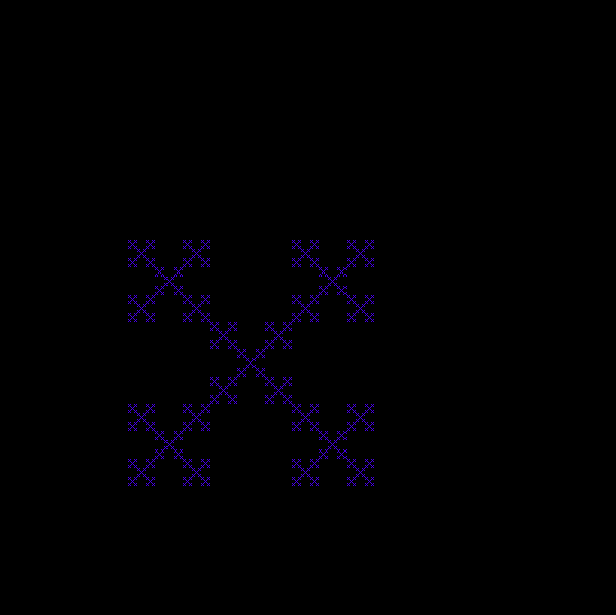
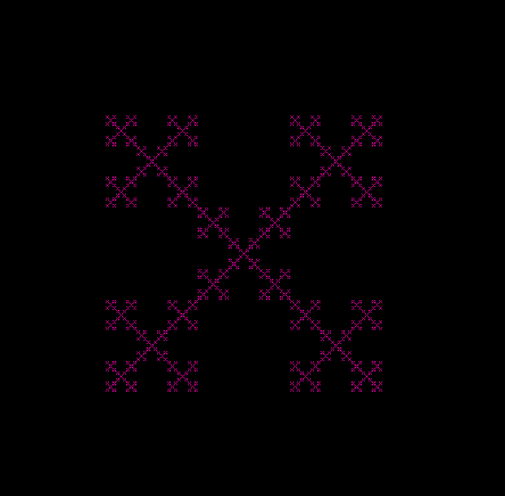

# ✨ Box Fraktal - GCLC

Ovaj projekat prikazuje animirani **box fraktal** napravljen u **GCLC**-u.  
Fraktal **pulsira** (menja veličinu) i **menja boju** od plave ka crvenoj tokom animacije.  
Rekurzija deli kvadrat na 3×3 mrežu i zadržava samo pet podkvadrata.

## 🖼️ Vizuelni prikaz

### 1. Fraktal – početni izgled

### 2. Fraktal - tokom animacije

